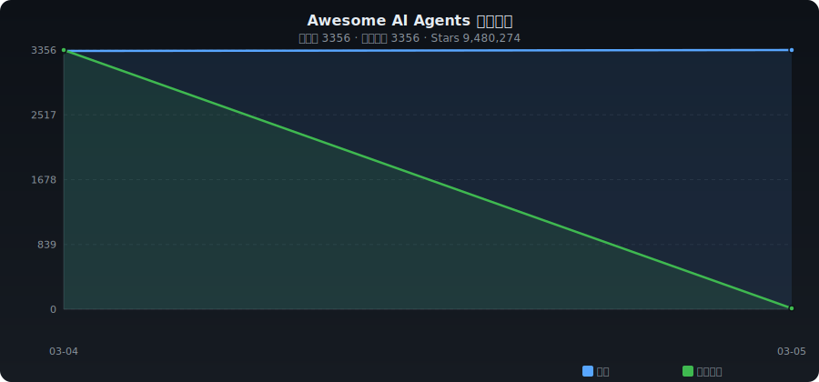

# ✨ Awesome AI Agents

[English](./README.md) | **中文**

> AI Agent 框架、编排工具、多智能体平台精选集合 —— 自动收录整理

   

---

## 📈 收录趋势

<p align="center"></p>

---

## 📊 分类统计

| 分类 | 数量 | 占比 |
|------|-----:|-----:|
| 🏗️ 通用框架 | 714 | ██████ 18.7% |
| 👥 多智能体 | 376 | ███ 9.9% |
| 💻 编程 Agent | 667 | █████ 17.5% |
| 🌐 浏览器 Agent | 298 | ██ 7.8% |
| 🔀 工作流 & 编排 | 660 | █████ 17.3% |
| 📚 RAG & 知识库 | 323 | ██ 8.5% |
| 💬 对话 & 聊天 | 226 | █ 5.9% |
| ⚡ 自动化 & RPA | 81 | █ 2.1% |
| 🔬 研究 & 论文 | 83 | █ 2.2% |
| 📦 其他 | 388 | ███ 10.2% |

---

## 🔥 每日热门 (2026-04-05)

| # | 项目 | ⭐ | 📈 日增 | 描述 |
|:-:|------|---:|-------:|------|
| 1 | [VoltAgent/awesome-design-md](https://github.com/VoltAgent/awesome-design-md) | 10,887 | +4966 | Collection of DESIGN.md files that capture design ... |
| 2 | [Gitlawb/openclaude](https://github.com/Gitlawb/openclaude) | 15,454 | +2273 | Open Claude Is Open-source coding-agent CLI for Op... |
| 3 | [affaan-m/everything-claude-code](https://github.com/affaan-m/everything-claude-code) | 139,067 | +2172 | The agent harness performance optimization system.... |
| 4 | [luongnv89/claude-howto](https://github.com/luongnv89/claude-howto) | 19,768 | +1364 | A visual, example-driven guide to Claude Code — fr... |
| 5 | [NousResearch/hermes-agent](https://github.com/NousResearch/hermes-agent) | 25,570 | +1209 | 随着你成长的代理人 |
| 6 | [obra/superpowers](https://github.com/obra/superpowers) | 135,720 | +1133 | 提供一个有效的代理技能框架和软件开发方法. |
| 7 | [JackChen-me/open-multi-agent](https://github.com/JackChen-me/open-multi-agent) | 4,520 | +975 | Production-grade multi-agent orchestration framewo... |
| 8 | [block/goose](https://github.com/block/goose) | 36,142 | +848 | an open source, extensible AI agent that goes beyo... |
| 9 | [karpathy/autoresearch](https://github.com/karpathy/autoresearch) | 66,079 | +763 | 人工智能代理自动进行单个GPU纳米聊天训练的研究 |
| 10 | [Yeachan-Heo/oh-my-claudecode](https://github.com/Yeachan-Heo/oh-my-claudecode) | 24,173 | +668 | Teams-first Multi-agent orchestration for Claude C... |
| 11 | [anthropics/claude-code](https://github.com/anthropics/claude-code) | 109,127 | +632 | 克劳德代码是一个代理编码工具,它生活在终端中,理解你的代码基础,并通过执行常规任务,解释复杂代码和处... |
| 12 | [anomalyco/opencode](https://github.com/anomalyco/opencode) | 137,442 | +571 | 开源编码代理. |
| 13 | [abhigyanpatwari/GitNexus](https://github.com/abhigyanpatwari/GitNexus) | 22,076 | +571 | GitNexus: The Zero-Server Code Intelligence Engine... |
| 14 | [bytedance/deer-flow](https://github.com/bytedance/deer-flow) | 58,052 | +486 | An open-source SuperAgent harness that researches,... |
| 15 | [firecrawl/firecrawl](https://github.com/firecrawl/firecrawl) | 104,343 | +461 | 🔥 The Web Data API for AI - Power AI agents with c... |
| 16 | [TauricResearch/TradingAgents](https://github.com/TauricResearch/TradingAgents) | 47,275 | +406 | TradingAgents: Multi-Agents LLM Financial Trading ... |
| 17 | [memvid/memvid](https://github.com/memvid/memvid) | 14,071 | +383 | Memory layer for AI Agents. Replace complex RAG pi... |
| 18 | [jackwener/opencli](https://github.com/jackwener/opencli) | 13,218 | +379 | Make Any Website & Tool Your CLI. A universal CLI ... |
| 19 | [shareAI-lab/learn-claude-code](https://github.com/shareAI-lab/learn-claude-code) | 48,448 | +378 | Bash is all you need -  A nano Claude Code–like ag... |
| 20 | [vercel-labs/opensrc](https://github.com/vercel-labs/opensrc) | 1,505 | +375 | Fetch source code for npm packages to give AI codi... |

---

## 📁 分类目录

- [🏗️ 通用框架](#framework) (714)
- [👥 多智能体](#multi-agent) (376)
- [💻 编程 Agent](#coding) (667)
- [🌐 浏览器 Agent](#browser) (298)
- [🔀 工作流 & 编排](#workflow) (660)
- [📚 RAG & 知识库](#rag) (323)
- [💬 对话 & 聊天](#chatbot) (226)
- [⚡ 自动化 & RPA](#automation) (81)
- [🔬 研究 & 论文](#research) (83)
- [📦 其他](#other) (388)

---

### <a id="framework"></a>🏗️ 通用框架

| 项目 | ⭐ | 语言 | 描述 |
|------|---:|:----:|------|
| [Snailclimb/JavaGuide](https://github.com/Snailclimb/JavaGuide) | 154,663 | Java | Java 面试 & 后端通用面试指南，覆盖计算机基础、数据库、分布式、高并发、系统设计与 AI 应用开发 |
| [obra/superpowers](https://github.com/obra/superpowers) | 135,720 | Shell | An agentic skills framework & software development methodology that wo... |
| [langchain-ai/langchain](https://github.com/langchain-ai/langchain) | 132,424 | Python | The agent engineering platform |
| [dair-ai/Prompt-Engineering-Guide](https://github.com/dair-ai/Prompt-Engineering-Guide) | 72,839 | MDX | 🐙 Guides, papers, lessons, notebooks and resources for prompt engineer... |
| [FoundationAgents/MetaGPT](https://github.com/FoundationAgents/MetaGPT) | 66,652 | Python | 🌟 The Multi-Agent Framework: First AI Software Company, Towards Natura... |
| [OpenBB-finance/OpenBB](https://github.com/OpenBB-finance/OpenBB) | 65,369 | Python | Financial data platform for analysts, quants and AI agents. |
| [geekan/MetaGPT](https://github.com/FoundationAgents/MetaGPT) | 64,757 | Python | 🌟 The Multi-Agent Framework: First AI Software Company, Towards Natura... |
| [microsoft/autogen](https://github.com/microsoft/autogen) | 56,714 | Python | A programming framework for agentic AI |
| [microsoft/ai-agents-for-beginners](https://github.com/microsoft/ai-agents-for-beginners) | 55,952 | Jupyter Notebook | 12 Lessons to Get Started Building AI Agents |
| [crewAIInc/crewAI](https://github.com/crewAIInc/crewAI) | 48,077 | Python | Framework for orchestrating role-playing, autonomous AI agents. By fos... |
| [TauricResearch/TradingAgents](https://github.com/TauricResearch/TradingAgents) | 47,275 | Python | TradingAgents: Multi-Agents LLM Financial Trading Framework |
| [joaomdmoura/CrewAI](https://github.com/crewAIInc/crewAI) | 45,102 | Python | Framework for orchestrating role-playing, autonomous AI agents. By fos... |
| [joaomdmoura/crewAI](https://github.com/crewAIInc/crewAI) | 45,102 | Python | Framework for orchestrating role-playing, autonomous AI agents. By fos... |
| [joaomdmoura/crewai](https://github.com/crewAIInc/crewAI) | 45,102 | Python | Framework for orchestrating role-playing, autonomous AI agents. By fos... |
| [mindsdb/mindsdb](https://github.com/mindsdb/mindsdb) | 38,907 | Python | Query Engine for AI Analytics: Build self-reasoning agents across all ... |
| [ToolJet/ToolJet](https://github.com/ToolJet/ToolJet) | 37,714 | JavaScript | ToolJet is the open-source foundation of ToolJet AI - the AI-native pl... |
| [patchy631/ai-engineering-hub](https://github.com/patchy631/ai-engineering-hub) | 33,182 | Jupyter Notebook | In-depth tutorials on LLMs, RAGs and real-world AI agent applications. |
| [alibaba/nacos](https://github.com/alibaba/nacos) | 32,791 | Java | an easy-to-use dynamic service discovery, configuration and service ma... |
| [badlogic/pi-mono](https://github.com/badlogic/pi-mono) | 31,660 | TypeScript | AI agent toolkit: coding agent CLI, unified LLM API, TUI & web UI libr... |
| [ruvnet/ruflo](https://github.com/ruvnet/ruflo) | 29,923 | TypeScript | 🌊 The leading agent orchestration platform for Claude. Deploy intellig... |
| [github/awesome-copilot](https://github.com/github/awesome-copilot) | 28,535 | Python | Community-contributed instructions, agents, skills, and configurations... |
| [nrwl/nx](https://github.com/nrwl/nx) | 28,478 | TypeScript | The Monorepo Platform that amplifies both developers and AI agents. Nx... |
| [Budibase/budibase](https://github.com/Budibase/budibase) | 27,800 | TypeScript | Build AI Agents the easy way. Supports PostgreSQL, MySQL, MariaDB, MSS... |
| [ComposioHQ/composio](https://github.com/ComposioHQ/composio) | 27,641 | TypeScript | Composio powers 1000+ toolkits, tool search, context management, authe... |
| [e2b-dev/awesome-ai-agents](https://github.com/e2b-dev/awesome-ai-agents) | 27,060 | - | A list of AI autonomous agents |
| [qwibitai/nanoclaw](https://github.com/qwibitai/nanoclaw) | 26,539 | TypeScript | A lightweight alternative to OpenClaw that runs in containers for secu... |
| [huggingface/smolagents](https://github.com/huggingface/smolagents) | 26,446 | Python | 🤗 smolagents: a barebones library for agents that think in code. |
| [mlflow/mlflow](https://github.com/mlflow/mlflow) | 25,128 | Python | The open source developer platform to build AI agents and models with ... |
| [zai-org/Open-AutoGLM](https://github.com/zai-org/Open-AutoGLM) | 24,707 | Python | An Open Phone Agent Model & Framework. Unlocking the AI Phone for Ever... |
| [langfuse/langfuse](https://github.com/langfuse/langfuse) | 24,369 | TypeScript | 🪢 Open source LLM engineering platform: LLM Observability, metrics, ev... |
| [vercel/ai](https://github.com/vercel/ai) | 23,256 | TypeScript | The AI Toolkit for TypeScript. From the creators of Next.js, the AI SD... |
| [letta-ai/letta](https://github.com/letta-ai/letta) | 21,899 | Python | Letta is the platform for building stateful agents: AI with advanced m... |
| [cpacker/MemGPT](https://github.com/letta-ai/letta) | 21,389 | Python | Letta is the platform for building stateful agents: AI with advanced m... |
| [winfunc/opcode](https://github.com/winfunc/opcode) | 21,304 | TypeScript | A powerful GUI app and Toolkit for Claude Code - Create custom agents,... |
| [getAsterisk/claudia](https://github.com/winfunc/opcode) | 20,778 | TypeScript | A powerful GUI app and Toolkit for Claude Code - Create custom agents,... |
| [qax-os/excelize](https://github.com/qax-os/excelize) | 20,445 | Go | Go language library for reading and writing Microsoft Excel™ (XLAM / X... |
| [stitionai/devika](https://github.com/stitionai/devika) | 19,486 | Python | Devika is the first open-source implementation of an Agentic Software ... |
| [promptfoo/promptfoo](https://github.com/promptfoo/promptfoo) | 19,452 | TypeScript | Test your prompts, agents, and RAGs. AI Red teaming, pentesting, and v... |
| [humanlayer/12-factor-agents](https://github.com/humanlayer/12-factor-agents) | 19,104 | TypeScript | What are the principles we can use to build LLM-powered software that ... |
| [coreyhaines31/marketingskills](https://github.com/coreyhaines31/marketingskills) | 18,910 | JavaScript | Marketing skills for Claude Code and AI agents. CRO, copywriting, SEO,... |

---

### <a id="multi-agent"></a>👥 多智能体

| 项目 | ⭐ | 语言 | 描述 |
|------|---:|:----:|------|
| [lobehub/lobehub](https://github.com/lobehub/lobehub) | 74,755 | TypeScript | The ultimate space for work and life — to find, build, and collaborate... |
| [lobehub/lobe-chat](https://github.com/lobehub/lobehub) | 73,041 | TypeScript | The ultimate space for work and life — to find, build, and collaborate... |
| [OpenBMB/ChatDev](https://github.com/OpenBMB/ChatDev) | 32,575 | Python | ChatDev 2.0: Dev All through LLM-powered Multi-Agent Collaboration |
| [Yeachan-Heo/oh-my-claudecode](https://github.com/Yeachan-Heo/oh-my-claudecode) | 24,173 | TypeScript | Teams-first Multi-agent orchestration for Claude Code |
| [RooCodeInc/Roo-Code](https://github.com/RooCodeInc/Roo-Code) | 22,983 | TypeScript | Roo Code gives you a whole dev team of AI agents in your code editor. |
| [openai/swarm](https://github.com/openai/swarm) | 21,276 | Python | Educational framework exploring ergonomic, lightweight multi-agent orc... |
| [openai/symphony](https://github.com/openai/symphony) | 14,585 | Elixir | Symphony turns project work into isolated, autonomous implementation r... |
| [THU-MAIC/OpenMAIC](https://github.com/THU-MAIC/OpenMAIC) | 13,849 | TypeScript | Open Multi-Agent Interactive Classroom — Get an immersive, multi-agent... |
| [gastownhall/gastown](https://github.com/gastownhall/gastown) | 13,527 | Go | Gas Town - multi-agent workspace manager |
| [steveyegge/gastown](https://github.com/steveyegge/gastown) | 13,300 | Go | Gas Town - multi-agent workspace manager |
| [HKUDS/AI-Trader](https://github.com/HKUDS/AI-Trader) | 12,154 | Python | "AI-Trader: 100% Fully-Automated Trading Powered by Agent Swarm Intell... |
| [ringhyacinth/Star-Office-UI](https://github.com/ringhyacinth/Star-Office-UI) | 6,511 | HTML | A pixel office for your OpenClaw: turn invisible work states into a co... |
| [kuafuai/DevOpsGPT](https://github.com/kuafuai/DevOpsGPT) | 5,963 | HTML | Multi agent system for AI-driven software development. Combine LLM wit... |
| [ComposioHQ/agent-orchestrator](https://github.com/ComposioHQ/agent-orchestrator) | 5,769 | TypeScript | Agentic orchestrator for parallel coding agents — plans tasks, spawns ... |
| [MrLesk/Backlog.md](https://github.com/MrLesk/Backlog.md) | 5,292 | TypeScript | Backlog.md - A tool for managing project collaboration between humans ... |
| [LantaoYu/MARL-Papers](https://github.com/LantaoYu/MARL-Papers) | 4,779 | - | Paper list of multi-agent reinforcement learning (MARL) |
| [eastlondoner/vibe-tools](https://github.com/eastlondoner/vibe-tools) | 4,752 | TypeScript | Give Cursor Agent an AI Team and Advanced Skills |
| [eastlondoner/cursor-tools](https://github.com/eastlondoner/vibe-tools) | 4,735 | TypeScript | Give Cursor Agent an AI Team and Advanced Skills |
| [JackChen-me/open-multi-agent](https://github.com/JackChen-me/open-multi-agent) | 4,520 | TypeScript | Production-grade multi-agent orchestration framework. Model-agnostic, ... |
| [VRSEN/agency-swarm](https://github.com/VRSEN/agency-swarm) | 4,142 | Python | Reliable Multi-Agent Orchestration Framework |
| [vijaythecoder/awesome-claude-agents](https://github.com/vijaythecoder/awesome-claude-agents) | 4,125 | - | An orchestrated sub agent dev team powered by claude code |
| [agentscope-ai/HiClaw](https://github.com/agentscope-ai/HiClaw) | 3,883 | Shell | An open-source Collaborative Multi-Agent OS for transparent, human-in-... |
| [Narcooo/inkos](https://github.com/Narcooo/inkos) | 3,491 | TypeScript | Multi-agent novel production system — AI agents autonomously write, au... |
| [abhi1693/openclaw-mission-control](https://github.com/abhi1693/openclaw-mission-control) | 3,478 | TypeScript | AI Agent Orchestration Dashboard - Manage AI agents, assign tasks, and... |
| [TinyAGI/tinyagi](https://github.com/TinyAGI/tinyagi) | 3,473 | TypeScript | TinyAGI is the agent teams orchestrator for One Person Company. (fka T... |
| [datamllab/rlcard](https://github.com/datamllab/rlcard) | 3,433 | Python | Reinforcement Learning / AI Bots in Card (Poker) Games - Blackjack, Le... |
| [Farama-Foundation/PettingZoo](https://github.com/Farama-Foundation/PettingZoo) | 3,363 | Python | An API standard for multi-agent reinforcement learning environments, w... |
| [alibaba/hiclaw](https://github.com/alibaba/hiclaw) | 3,329 | Shell | Open-source Agent Teams system with IM-based multi-Agent collaboration... |
| [daveshap/OpenAI_Agent_Swarm](https://github.com/daveshap/OpenAI_Agent_Swarm) | 3,095 | Python | HAAS = Hierarchical Autonomous Agent Swarm - "Resistance is futile!" |
| [openai/multiagent-particle-envs](https://github.com/openai/multiagent-particle-envs) | 2,747 | Python | Code for a multi-agent particle environment used in the paper "Multi-A... |
| [mergisi/awesome-openclaw-agents](https://github.com/mergisi/awesome-openclaw-agents) | 2,558 | JavaScript | Curated list of AI agent templates for OpenClaw. Ready-to-use SOUL.md ... |
| [Memento-Teams/Memento](https://github.com/Memento-Teams/Memento) | 2,378 | Python | Official Code of Memento: Fine-tuning LLM Agents without Fine-tuning L... |
| [EvoScientist/EvoScientist](https://github.com/EvoScientist/EvoScientist) | 2,239 | Python | 🔬 Harness Vibe Research with Self-evolving AI Scientists |
| [KsanaDock/Microverse](https://github.com/KsanaDock/Microverse) | 2,205 | GDScript | A god-simulation sandbox game built on Godot 4 as a multi-agent AI soc... |
| [ZSeven-W/openpencil](https://github.com/ZSeven-W/openpencil) | 2,032 | TypeScript | AI-native open-source design tool. Design-as-Code.Prompt to UI on canv... |
| [spacedriveapp/spacebot](https://github.com/spacedriveapp/spacebot) | 2,028 | Rust | An AI agent for teams, communities, and multi-user environments. |
| [ZJU-FAST-Lab/ego-planner-swarm](https://github.com/ZJU-FAST-Lab/ego-planner-swarm) | 1,971 | C++ | An efficient single/multi-agent trajectory planner for multicopters. |
| [GuDaStudio/skills](https://github.com/GuDaStudio/skills) | 1,967 | PowerShell | This repository contains a collection of Agent Skills developed by Gud... |
| [openai/maddpg](https://github.com/openai/maddpg) | 1,958 | Python | Code for the MADDPG algorithm from the paper "Multi-Agent Actor-Critic... |
| [marlbenchmark/on-policy](https://github.com/marlbenchmark/on-policy) | 1,947 | Python | This is the official implementation of Multi-Agent PPO (MAPPO). |

---

### <a id="coding"></a>💻 编程 Agent

| 项目 | ⭐ | 语言 | 描述 |
|------|---:|:----:|------|
| [affaan-m/everything-claude-code](https://github.com/affaan-m/everything-claude-code) | 139,067 | JavaScript | The agent harness performance optimization system. Skills, instincts, ... |
| [anomalyco/opencode](https://github.com/anomalyco/opencode) | 137,442 | TypeScript | The open source coding agent. |
| [x1xhlol/system-prompts-and-models-of-ai-tools](https://github.com/x1xhlol/system-prompts-and-models-of-ai-tools) | 134,417 | - | FULL Augment Code, Claude Code, Cluely, CodeBuddy, Comet, Cursor, Devi... |
| [anthropics/claude-code](https://github.com/anthropics/claude-code) | 109,127 | Shell | Claude Code is an agentic coding tool that lives in your terminal, und... |
| [openai/codex](https://github.com/openai/codex) | 73,220 | Rust | Lightweight coding agent that runs in your terminal |
| [OpenHands/OpenHands](https://github.com/OpenHands/OpenHands) | 70,614 | Python | 🙌 OpenHands: AI-Driven Development |
| [OpenDevin/OpenDevin](https://github.com/OpenHands/OpenHands) | 68,529 | Python | 🙌 OpenHands: AI-Driven Development |
| [cline/cline](https://github.com/cline/cline) | 59,902 | TypeScript | Autonomous coding agent right in your IDE, capable of creating/editing... |
| [AntonOsika/gpt-engineer](https://github.com/AntonOsika/gpt-engineer) | 55,210 | Python | CLI platform to experiment with codegen. Precursor to: https://lovable... |
| [shareAI-lab/learn-claude-code](https://github.com/shareAI-lab/learn-claude-code) | 48,448 | TypeScript | Bash is all you need -  A nano Claude Code–like agent, built from 0 to... |
| [code-yeongyu/oh-my-openagent](https://github.com/code-yeongyu/oh-my-openagent) | 48,384 | TypeScript | omo; the best agent harness - previously oh-my-opencode |
| [CherryHQ/cherry-studio](https://github.com/CherryHQ/cherry-studio) | 42,945 | TypeScript | AI productivity studio with smart chat, autonomous agents, and 300+ as... |
| [ComposioHQ/awesome-claude-skills](https://github.com/ComposioHQ/awesome-claude-skills) | 40,571 | Python | A curated list of awesome Claude Skills, resources, and tools for cust... |
| [agno-agi/agno](https://github.com/agno-agi/agno) | 39,186 | Python | Build, run, manage agentic software at scale. |
| [code-yeongyu/oh-my-opencode](https://github.com/code-yeongyu/oh-my-opencode) | 37,503 | TypeScript | the best agent harness |
| [hesreallyhim/awesome-claude-code](https://github.com/hesreallyhim/awesome-claude-code) | 36,605 | Python | A curated list of awesome skills, hooks, slash-commands, agent orchest... |
| [block/goose](https://github.com/block/goose) | 36,142 | Rust | an open source, extensible AI agent that goes beyond code suggestions ... |
| [danny-avila/LibreChat](https://github.com/danny-avila/LibreChat) | 35,237 | TypeScript | Enhanced ChatGPT Clone: Features Agents, MCP, DeepSeek, Anthropic, AWS... |
| [sickn33/antigravity-awesome-skills](https://github.com/sickn33/antigravity-awesome-skills) | 30,760 | Python | The Ultimate Collection of 900+ Agentic Skills for Claude Code/Antigra... |
| [warpdotdev/Warp](https://github.com/warpdotdev/Warp) | 26,318 | - | Warp is the agentic development environment, built for coding with mul... |
| [BloopAI/vibe-kanban](https://github.com/BloopAI/vibe-kanban) | 24,397 | Rust | Get 10X more out of Claude Code, Codex or any coding agent |
| [charmbracelet/crush](https://github.com/charmbracelet/crush) | 22,513 | Go | Glamourous agentic coding for all 💘 |
| [oraios/serena](https://github.com/oraios/serena) | 22,489 | Python | A powerful coding agent toolkit providing semantic retrieval and editi... |
| [QwenLM/qwen-code](https://github.com/QwenLM/qwen-code) | 21,822 | TypeScript | An open-source AI agent that lives in your terminal. |
| [gastownhall/beads](https://github.com/gastownhall/beads) | 20,263 | Go | Beads - A memory upgrade for your coding agent |
| [steveyegge/beads](https://github.com/steveyegge/beads) | 20,019 | Go | Beads - A memory upgrade for your coding agent |
| [luongnv89/claude-howto](https://github.com/luongnv89/claude-howto) | 19,768 | Python | A visual, example-driven guide to Claude Code — from basic concepts to... |
| [agentsmd/agents.md](https://github.com/agentsmd/agents.md) | 19,764 | TypeScript | AGENTS.md — a simple, open format for guiding coding agents |
| [kepano/obsidian-skills](https://github.com/kepano/obsidian-skills) | 19,681 | - | Agent skills for Obsidian. Teach your agent to use Markdown, Bases, JS... |
| [SWE-agent/SWE-agent](https://github.com/SWE-agent/SWE-agent) | 18,922 | Python | SWE-agent takes a GitHub issue and tries to automatically fix it, usin... |
| [princeton-nlp/SWE-agent](https://github.com/SWE-agent/SWE-agent) | 18,630 | Python | SWE-agent takes a GitHub issue and tries to automatically fix it, usin... |
| [mvanhorn/last30days-skill](https://github.com/mvanhorn/last30days-skill) | 18,574 | Python | AI agent skill that researches any topic across Reddit, X, YouTube, HN... |
| [OthmanAdi/planning-with-files](https://github.com/OthmanAdi/planning-with-files) | 18,067 | Python | Claude Code skill implementing Manus-style persistent markdown plannin... |
| [Kilo-Org/kilocode](https://github.com/Kilo-Org/kilocode) | 17,689 | TypeScript | Kilo is the all-in-one agentic engineering platform. Build, ship, and ... |
| [jarrodwatts/claude-hud](https://github.com/jarrodwatts/claude-hud) | 16,851 | JavaScript | A Claude Code plugin that shows what's happening - context usage, acti... |
| [Gitlawb/openclaude](https://github.com/Gitlawb/openclaude) | 15,454 | TypeScript | Open Claude Is Open-source coding-agent CLI for OpenAI, Gemini, DeepSe... |
| [plandex-ai/plandex](https://github.com/plandex-ai/plandex) | 15,204 | Go | Open source AI coding agent. Designed for large projects and real worl... |
| [Panniantong/Agent-Reach](https://github.com/Panniantong/Agent-Reach) | 15,146 | Python | Give your AI agent eyes to see the entire internet. Read & search Twit... |
| [HKUDS/DeepCode](https://github.com/HKUDS/DeepCode) | 15,093 | Python | "DeepCode: Open Agentic Coding (Paper2Code & Text2Web & Text2Backend)" |
| [VoltAgent/awesome-agent-skills](https://github.com/VoltAgent/awesome-agent-skills) | 14,193 | - | Claude Code Skills and 500+ agent skills from official dev teams and t... |

---

### <a id="browser"></a>🌐 浏览器 Agent

| 项目 | ⭐ | 语言 | 描述 |
|------|---:|:----:|------|
| [firecrawl/firecrawl](https://github.com/firecrawl/firecrawl) | 104,343 | TypeScript | 🔥 The Web Data API for AI - Power AI agents with clean web data |
| [browser-use/browser-use](https://github.com/browser-use/browser-use) | 86,087 | Python | 🌐 Make websites accessible for AI agents. Automate tasks online with e... |
| [reworkd/AgentGPT](https://github.com/reworkd/AgentGPT) | 35,930 | TypeScript | 🤖 Assemble, configure, and deploy autonomous AI Agents in your browser... |
| [ChromeDevTools/chrome-devtools-mcp](https://github.com/ChromeDevTools/chrome-devtools-mcp) | 33,236 | TypeScript | Chrome DevTools for coding agents |
| [feder-cr/Jobs_Applier_AI_Agent_AIHawk](https://github.com/feder-cr/Jobs_Applier_AI_Agent_AIHawk) | 29,572 | Python | AIHawk aims to easy job hunt process by automating the job application... |
| [bytedance/UI-TARS-desktop](https://github.com/bytedance/UI-TARS-desktop) | 29,263 | TypeScript | The Open-Source Multimodal AI Agent Stack: Connecting Cutting-Edge AI ... |
| [vercel-labs/agent-browser](https://github.com/vercel-labs/agent-browser) | 27,193 | Rust | Browser automation CLI for AI agents |
| [assafelovic/gpt-researcher](https://github.com/assafelovic/gpt-researcher) | 26,248 | Python | An autonomous agent that conducts deep research on any data using any ... |
| [Alibaba-NLP/DeepResearch](https://github.com/Alibaba-NLP/DeepResearch) | 18,601 | Python | Tongyi Deep Research, the Leading Open-source Deep Research Agent |
| [browser-use/web-ui](https://github.com/browser-use/web-ui) | 15,806 | Python | 🖥️ Run AI Agent in your browser. |
| [alibaba/page-agent](https://github.com/alibaba/page-agent) | 15,168 | TypeScript | JavaScript in-page GUI agent. Control web interfaces with natural lang... |
| [casdoor/casdoor](https://github.com/casdoor/casdoor) | 13,283 | Go | An open-source AI-first Identity and Access Management (IAM) /AI MCP &... |
| [nanobrowser/nanobrowser](https://github.com/nanobrowser/nanobrowser) | 12,619 | TypeScript | Open-Source Chrome extension for AI-powered web automation. Run multi-... |
| [browseros-ai/BrowserOS](https://github.com/browseros-ai/BrowserOS) | 10,290 | C++ | 🌐 The open-source Agentic browser; alternative to ChatGPT Atlas, Perpl... |
| [faisalman/ua-parser-js](https://github.com/faisalman/ua-parser-js) | 10,100 | JavaScript | UAParser.js - The Essential Web Development Tool for User-Agent Detect... |
| [microsoft/magentic-ui](https://github.com/microsoft/magentic-ui) | 9,761 | Python | A research prototype of a human-centered web agent |
| [ntegrals/openbrowser](https://github.com/ntegrals/openbrowser) | 9,361 | TypeScript | Let AI agents browse the web. An autonomous toolkit for browser-based ... |
| [TeamWiseFlow/wiseflow](https://github.com/TeamWiseFlow/wiseflow) | 8,155 | JavaScript | enhance any agent's browser use skill |
| [steel-dev/steel-browser](https://github.com/steel-dev/steel-browser) | 6,778 | TypeScript | 🔥 Open Source Browser API for AI Agents & Apps. Steel Browser is a bat... |
| [Ylianst/MeshCentral](https://github.com/Ylianst/MeshCentral) | 6,366 | HTML | A complete web-based remote monitoring and management web site. Once s... |
| [lavague-ai/LaVague](https://github.com/lavague-ai/LaVague) | 6,317 | Python | Large Action Model framework to develop AI Web Agents |
| [nickscamara/open-deep-research](https://github.com/nickscamara/open-deep-research) | 6,207 | TypeScript | An open source deep research clone. AI Agent that reasons large amount... |
| [SawyerHood/dev-browser](https://github.com/SawyerHood/dev-browser) | 5,433 | TypeScript | A Claude Skill to give your agent the ability to use a web browser |
| [tianshiyeben/wgcloud](https://github.com/tianshiyeben/wgcloud) | 5,116 | Java | Linux运维监控工具，支持系统硬件信息，内存，CPU，温度，磁盘空间及IO，硬盘smart，GPU，防火墙，网络流量速率等监控，服务接口监... |
| [microsoft/fara](https://github.com/microsoft/fara) | 4,764 | Python | Fara-7B: An Efficient Agentic Model for Computer Use |
| [facebookarchive/WebDriverAgent](https://github.com/facebookarchive/WebDriverAgent) | 4,227 | Objective-C | A WebDriver server for iOS that runs inside the Simulator. |
| [epiral/bb-browser](https://github.com/epiral/bb-browser) | 4,106 | TypeScript | AI Agent browser automation CLI - control Chrome with user's login sta... |
| [magnitudedev/browser-agent](https://github.com/magnitudedev/browser-agent) | 4,014 | TypeScript | Open-source, vision-first browser agent |
| [ai-robots-txt/ai.robots.txt](https://github.com/ai-robots-txt/ai.robots.txt) | 3,753 | Python | A list of AI agents and robots to block. |
| [Atmosphere/atmosphere](https://github.com/Atmosphere/atmosphere) | 3,749 | Java | Real-time transport layer for Java AI agents. Build once with @Agent —... |
| [remorses/playwriter](https://github.com/remorses/playwriter) | 3,311 | HTML | Chrome extension to let agents control your browser. Runs Playwright s... |
| [ElricLiu/AutoGPT-Next-Web](https://github.com/ElricLiu/AutoGPT-Next-Web) | 3,010 | TypeScript | 🤖 Assemble, configure, and deploy autonomous AI Agents in your browser... |
| [VibiumDev/vibium](https://github.com/VibiumDev/vibium) | 2,747 | Go | Browser automation for AI agents and humans |
| [oxylabs/oxylabs-ai-studio-py](https://github.com/oxylabs/oxylabs-ai-studio-py) | 2,716 | Python | Structured data gathering from any website using AI-powered scraper, c... |
| [lmnr-ai/index](https://github.com/lmnr-ai/index) | 2,341 | Python | The SOTA Open-Source Browser Agent for autonomously performing complex... |
| [coleam00/mcp-crawl4ai-rag](https://github.com/coleam00/mcp-crawl4ai-rag) | 2,129 | Python | Web Crawling and RAG Capabilities for AI Agents and AI Coding Assistan... |
| [TurixAI/TuriX-CUA](https://github.com/TurixAI/TuriX-CUA) | 2,085 | Python | This is the official website for TuriX Computer-use-Agent |
| [tobie/ua-parser](https://github.com/tobie/ua-parser) | 1,967 | Perl | A multi-language port of Browserscope's user agent parser. |
| [e2b-dev/open-computer-use](https://github.com/e2b-dev/open-computer-use) | 1,953 | Python | AI computer use powered by open source LLMs and E2B Desktop Sandbox |
| [liltom-eth/llama2-webui](https://github.com/liltom-eth/llama2-webui) | 1,943 | Jupyter Notebook | Run any Llama 2 locally with gradio UI on GPU or CPU from anywhere (Li... |

---

### <a id="workflow"></a>🔀 工作流 & 编排

| 项目 | ⭐ | 语言 | 描述 |
|------|---:|:----:|------|
| [langflow-ai/langflow](https://github.com/langflow-ai/langflow) | 146,587 | Python | Langflow is a powerful tool for building and deploying AI-powered agen... |
| [langgenius/dify](https://github.com/langgenius/dify) | 136,109 | TypeScript | Production-ready platform for agentic workflow development. |
| [microsoft/markitdown](https://github.com/microsoft/markitdown) | 93,316 | Python | Python tool for converting files and office documents to Markdown. |
| [opendatalab/MinerU](https://github.com/opendatalab/MinerU) | 58,144 | Python | Transforms complex documents like PDFs into LLM-ready markdown/JSON fo... |
| [bytedance/deer-flow](https://github.com/bytedance/deer-flow) | 58,052 | Python | An open-source SuperAgent harness that researches, codes, and creates.... |
| [FlowiseAI/Flowise](https://github.com/FlowiseAI/Flowise) | 51,555 | TypeScript | Build AI Agents, Visually |
| [jeecgboot/JeecgBoot](https://github.com/jeecgboot/JeecgBoot) | 45,733 | Java | 【AI低代码平台】“低代码+零代码”双模驱动AI智能平台  AI low-code platform empowers enterprise... |
| [wshobson/agents](https://github.com/wshobson/agents) | 32,974 | Python | Intelligent automation and multi-agent orchestration for Claude Code |
| [continuedev/continue](https://github.com/continuedev/continue) | 32,294 | TypeScript | ⏩ Source-controlled AI checks, enforceable in CI. Powered by the open-... |
| [conductor-oss/conductor](https://github.com/conductor-oss/conductor) | 31,602 | Java | Conductor is an event driven agentic orchestration platform providing ... |
| [langchain-ai/langgraph](https://github.com/langchain-ai/langgraph) | 28,457 | Python | Build resilient language agents as graphs. |
| [labring/FastGPT](https://github.com/labring/FastGPT) | 27,617 | TypeScript | FastGPT is a knowledge-based platform built on the LLMs, offers a comp... |
| [huggingface/agents-course](https://github.com/huggingface/agents-course) | 27,576 | MDX | This repository contains the Hugging Face Agents Course. |
| [deepset-ai/haystack](https://github.com/deepset-ai/haystack) | 24,720 | MDX | Open-source AI orchestration framework for building context-engineered... |
| [activepieces/activepieces](https://github.com/activepieces/activepieces) | 21,577 | TypeScript | AI Agents & MCPs & AI Workflow Automation • (~400 MCP servers for AI a... |
| [huggingface/datasets](https://github.com/huggingface/datasets) | 21,246 | Python | 🤗 The largest hub of ready-to-use datasets for AI models with fast, ea... |
| [NirDiamant/GenAI_Agents](https://github.com/NirDiamant/GenAI_Agents) | 21,014 | Jupyter Notebook | This repository provides tutorials and implementations for various Gen... |
| [openai/openai-agents-python](https://github.com/openai/openai-agents-python) | 20,577 | Python | A lightweight, powerful framework for multi-agent workflows |
| [langchain-ai/deepagents](https://github.com/langchain-ai/deepagents) | 19,255 | Python | Deep Agents is an agent harness built on langchain and langgraph. Deep... |
| [comet-ml/opik](https://github.com/comet-ml/opik) | 18,652 | Python | Debug, evaluate, and monitor your LLM applications, RAG systems, and a... |
| [eosphoros-ai/DB-GPT](https://github.com/eosphoros-ai/DB-GPT) | 18,444 | Python | AI Native Data App Development framework with AWEL(Agentic Workflow Ex... |
| [google-gemini/gemini-fullstack-langgraph-quickstart](https://github.com/google-gemini/gemini-fullstack-langgraph-quickstart) | 18,075 | Jupyter Notebook | Get started with building Fullstack Agents using Gemini 2.5 and LangGr... |
| [mayooear/ai-pdf-chatbot-langchain](https://github.com/mayooear/ai-pdf-chatbot-langchain) | 16,433 | TypeScript | AI PDF chatbot agent built with LangChain & LangGraph |
| [triggerdotdev/trigger.dev](https://github.com/triggerdotdev/trigger.dev) | 14,370 | TypeScript | Trigger.dev – build and deploy fully‑managed AI agents and workflows |
| [cft0808/edict](https://github.com/cft0808/edict) | 14,369 | Python | 🏛️ 三省六部制 · OpenClaw Multi-Agent Orchestration System — 9 specialized A... |
| [MODSetter/SurfSense](https://github.com/MODSetter/SurfSense) | 13,662 | Python | Open source alternative to NotebookLM for teams. Join our Discord: htt... |
| [NevaMind-AI/memU](https://github.com/NevaMind-AI/memU) | 13,304 | Python | Memory for 24/7 proactive agents like openclaw (moltbot, clawdbot). |
| [creativetimofficial/ui](https://github.com/creativetimofficial/ui) | 11,799 | TypeScript | Open-source components, blocks, and AI agents designed to speed up you... |
| [dataelement/bisheng](https://github.com/dataelement/bisheng) | 11,287 | TypeScript | BISHENG is an open LLM devops platform for next generation Enterprise ... |
| [iflytek/astron-agent](https://github.com/iflytek/astron-agent) | 10,890 | Java | Enterprise-grade, commercial-friendly agentic workflow platform for bu... |
| [saturndec/waoowaoo](https://github.com/saturndec/waoowaoo) | 10,826 | TypeScript | 首家工业级全流程 AI 影视生产平台。Industry-first professional AI Agent platform for c... |
| [The-Pocket/PocketFlow](https://github.com/The-Pocket/PocketFlow) | 10,352 | Python | Pocket Flow: 100-line LLM framework. Let Agents build Agents! |
| [Arindam200/awesome-ai-apps](https://github.com/Arindam200/awesome-ai-apps) | 9,512 | Python | A collection of projects showcasing RAG, agents, workflows, and other ... |
| [OpenPipe/ART](https://github.com/OpenPipe/ART) | 9,132 | Python | Agent Reinforcement Trainer: train multi-step agents for real-world ta... |
| [alibaba/spring-ai-alibaba](https://github.com/alibaba/spring-ai-alibaba) | 9,095 | Java | Agentic AI Framework for Java Developers |
| [microsoft/agent-framework](https://github.com/microsoft/agent-framework) | 8,849 | Python | A framework for building, orchestrating and deploying AI agents and mu... |
| [waoowaooAI/waoowaoo](https://github.com/waoowaooAI/waoowaoo) | 8,507 | TypeScript | 首家工业级全流程 AI 影视生产平台。Industry-first professional AI Agent platform for c... |
| [frankbria/ralph-claude-code](https://github.com/frankbria/ralph-claude-code) | 8,443 | Shell | Autonomous AI development loop for Claude Code with intelligent exit d... |
| [lastmile-ai/mcp-agent](https://github.com/lastmile-ai/mcp-agent) | 8,202 | Python | Build effective agents using Model Context Protocol and simple workflo... |
| [Donchitos/Claude-Code-Game-Studios](https://github.com/Donchitos/Claude-Code-Game-Studios) | 8,155 | Shell | Turn Claude Code into a full game dev studio — 48 AI agents, 36 workfl... |

---

### <a id="rag"></a>📚 RAG & 知识库

| 项目 | ⭐ | 语言 | 描述 |
|------|---:|:----:|------|
| [Shubhamsaboo/awesome-llm-apps](https://github.com/Shubhamsaboo/awesome-llm-apps) | 104,519 | Python | Collection of awesome LLM apps with AI Agents and RAG using OpenAI, An... |
| [infiniflow/ragflow](https://github.com/infiniflow/ragflow) | 77,161 | Python | RAGFlow is a leading open-source Retrieval-Augmented Generation (RAG) ... |
| [karpathy/autoresearch](https://github.com/karpathy/autoresearch) | 66,079 | Python | AI agents running research on single-GPU nanochat training automatical... |
| [Mintplex-Labs/anything-llm](https://github.com/Mintplex-Labs/anything-llm) | 55,623 | JavaScript | The all-in-one Desktop & Docker AI application with built-in RAG, AI a... |
| [run-llama/llama_index](https://github.com/run-llama/llama_index) | 48,307 | Python | LlamaIndex is the leading document agent and OCR platform |
| [thedotmack/claude-mem](https://github.com/thedotmack/claude-mem) | 45,298 | TypeScript | A Claude Code plugin that automatically captures everything Claude doe... |
| [chatchat-space/Langchain-Chatchat](https://github.com/chatchat-space/Langchain-Chatchat) | 37,744 | Python | Langchain-Chatchat（原Langchain-ChatGLM）基于 Langchain 与 ChatGLM, Qwen 与 L... |
| [khoj-ai/khoj](https://github.com/khoj-ai/khoj) | 33,880 | Python | Your AI second brain. Self-hostable. Get answers from the web or your ... |
| [datawhalechina/hello-agents](https://github.com/datawhalechina/hello-agents) | 33,715 | Python | 📚 《从零开始构建智能体》——从零开始的智能体原理与实践教程 |
| [datawhalechina/happy-llm](https://github.com/datawhalechina/happy-llm) | 28,407 | Jupyter Notebook | 📚 从零开始的大语言模型原理与实践教程 |
| [ZhuLinsen/daily_stock_analysis](https://github.com/ZhuLinsen/daily_stock_analysis) | 28,070 | Python | LLM驱动的 A/H/美股智能分析器，多数据源行情 + 实时新闻 + Gemini 决策仪表盘 + 多渠道推送，零成本，纯白嫖，定时运行 |
| [getzep/graphiti](https://github.com/getzep/graphiti) | 24,510 | Python | Build Real-Time Knowledge Graphs for AI Agents |
| [vanna-ai/vanna](https://github.com/vanna-ai/vanna) | 23,201 | Python | 🤖 Chat with your SQL database 📊. Accurate Text-to-SQL Generation via L... |
| [abhigyanpatwari/GitNexus](https://github.com/abhigyanpatwari/GitNexus) | 22,076 | TypeScript | GitNexus: The Zero-Server Code Intelligence Engine -       GitNexus is... |
| [volcengine/OpenViking](https://github.com/volcengine/OpenViking) | 21,065 | Python | OpenViking is an open-source context database designed specifically fo... |
| [virattt/dexter](https://github.com/virattt/dexter) | 20,965 | TypeScript | An autonomous agent for deep financial research |
| [1Panel-dev/MaxKB](https://github.com/1Panel-dev/MaxKB) | 20,644 | Python | 🔥 MaxKB is an open-source platform for building enterprise-grade agent... |
| [VectifyAI/PageIndex](https://github.com/VectifyAI/PageIndex) | 20,643 | Python | 📑 PageIndex: Document Index for Vectorless, Reasoning-based RAG |
| [AccumulateMore/CV](https://github.com/AccumulateMore/CV) | 19,286 | Jupyter Notebook | ✔（已完结）超级全面的 深度学习 笔记【土堆 Pytorch】【李沐 动手学深度学习】【吴恩达 深度学习】【大飞 大模型Agent】 |
| [arc53/DocsGPT](https://github.com/arc53/DocsGPT) | 17,809 | Python | Private AI platform for agents, assistants and enterprise search. Buil... |
| [topoteretes/cognee](https://github.com/topoteretes/cognee) | 14,947 | Python | Knowledge Engine for AI Agent Memory in 6 lines of code |
| [Canner/WrenAI](https://github.com/Canner/WrenAI) | 14,857 | TypeScript | ⚡️ GenBI (Generative BI) queries any database in natural language, gen... |
| [memvid/memvid](https://github.com/memvid/memvid) | 14,071 | Rust | Memory layer for AI Agents. Replace complex RAG pipelines with a serve... |
| [googleapis/genai-toolbox](https://github.com/googleapis/genai-toolbox) | 13,777 | Go | MCP Toolbox for Databases is an open source MCP server for databases. |
| [Tencent/WeKnora](https://github.com/Tencent/WeKnora) | 13,743 | Go | LLM-powered framework for deep document understanding, semantic retrie... |
| [MemoriLabs/Memori](https://github.com/MemoriLabs/Memori) | 13,092 | Python | SQL Native Memory Layer for LLMs, AI Agents & Multi-Agent Systems |
| [microsoft/RD-Agent](https://github.com/microsoft/RD-Agent) | 12,307 | Python | Research and development (R&D) is crucial for the enhancement of indus... |
| [langchain4j/langchain4j](https://github.com/langchain4j/langchain4j) | 11,463 | Java | LangChain4j is an open-source Java library that simplifies the integra... |
| [simular-ai/Agent-S](https://github.com/simular-ai/Agent-S) | 10,766 | Python | Agent S: an open agentic framework that uses computers like a human |
| [databendlabs/databend](https://github.com/databendlabs/databend) | 9,234 | Rust | Data Agent Ready Warehouse : One for  Analytics, Search, AI, Python Sa... |
| [activeloopai/deeplake](https://github.com/activeloopai/deeplake) | 9,060 | C++ | the GPU-native, sandboxed Postgres for AI agents |
| [MemTensor/MemOS](https://github.com/MemTensor/MemOS) | 8,142 | Python | AI memory OS for LLM and Agent systems(moltbot,clawdbot,openclaw), ena... |
| [WangRongsheng/awesome-LLM-resources](https://github.com/WangRongsheng/awesome-LLM-resources) | 8,007 | - | 🧑‍🚀 全世界最好的LLM资料总结（多模态生成、Agent、辅助编程、AI审稿、数据处理、模型训练、模型推理、o1 模型、MCP、小语言模型... |
| [SciPhi-AI/R2R](https://github.com/SciPhi-AI/R2R) | 7,752 | Python | SoTA production-ready AI retrieval system. Agentic Retrieval-Augmented... |
| [zilliztech/deep-searcher](https://github.com/zilliztech/deep-searcher) | 7,747 | Python | Open Source Deep Research Alternative to Reason and Search on Private ... |
| [WangRongsheng/awesome-LLM-resourses](https://github.com/WangRongsheng/awesome-LLM-resources) | 7,619 | - | 🧑‍🚀 全世界最好的LLM资料总结（多模态生成、Agent、辅助编程、AI审稿、数据处理、模型训练、模型推理、o1 模型、MCP、小语言模型... |
| [vectorize-io/hindsight](https://github.com/vectorize-io/hindsight) | 7,402 | Python | Hindsight: Agent Memory That  Learns |
| [InsForge/InsForge](https://github.com/InsForge/InsForge) | 7,246 | TypeScript | The backend built for agentic development. AI-native Supabase alternat... |
| [homanp/superagent](https://github.com/superagent-ai/superagent) | 6,430 | TypeScript | Superagent protects your AI applications against prompt injections, da... |
| [airweave-ai/airweave](https://github.com/airweave-ai/airweave) | 6,185 | Python | Open-source context retrieval layer for AI agents |

---

### <a id="chatbot"></a>💬 对话 & 聊天

| 项目 | ⭐ | 语言 | 描述 |
|------|---:|:----:|------|
| [unslothai/unsloth](https://github.com/unslothai/unsloth) | 59,507 | Python | Fine-tuning & Reinforcement Learning for LLMs. 🦥 Train OpenAI gpt-oss,... |
| [mem0ai/mem0](https://github.com/mem0ai/mem0) | 52,011 | Python | Universal memory layer for AI Agents |
| [mudler/LocalAI](https://github.com/mudler/LocalAI) | 44,200 | Go | :robot: The free, Open Source alternative to OpenAI, Claude and others... |
| [zhayujie/chatgpt-on-wechat](https://github.com/zhayujie/chatgpt-on-wechat) | 42,769 | Python | CowAgent是基于大模型的超级AI助理，能主动思考和任务规划、访问操作系统和外部资源、创造和执行Skills、拥有长期记忆并不断成长。同... |
| [2noise/ChatTTS](https://github.com/2noise/ChatTTS) | 39,016 | Python | A generative speech model for daily dialogue. |
| [QuivrHQ/quivr](https://github.com/QuivrHQ/quivr) | 38,972 | Python | Opiniated RAG for integrating GenAI in your apps 🧠   Focus on your pro... |
| [VoltAgent/awesome-openclaw-skills](https://github.com/VoltAgent/awesome-openclaw-skills) | 32,753 | - | The awesome collection of OpenClaw skills. 5,400+ skills filtered and ... |
| [CopilotKit/CopilotKit](https://github.com/CopilotKit/CopilotKit) | 29,985 | TypeScript | The Frontend for Agents & Generative UI. React + Angular |
| [zeroclaw-labs/zeroclaw](https://github.com/zeroclaw-labs/zeroclaw) | 29,488 | Rust | Fast, small, and fully autonomous AI assistant infrastructure — deploy... |
| [AstrBotDevs/AstrBot](https://github.com/AstrBotDevs/AstrBot) | 29,004 | Python | Agentic IM Chatbot infrastructure that integrates lots of IM platforms... |
| [simstudioai/sim](https://github.com/simstudioai/sim) | 27,566 | TypeScript | Build, deploy, and orchestrate AI agents. Sim is the central intellige... |
| [Fosowl/agenticSeek](https://github.com/Fosowl/agenticSeek) | 25,823 | Python | Fully Local Manus AI. No APIs, No $200 monthly bills. Enjoy an autonom... |
| [NousResearch/hermes-agent](https://github.com/NousResearch/hermes-agent) | 25,570 | Python | The agent that grows with you |
| [googleworkspace/cli](https://github.com/googleworkspace/cli) | 23,828 | Rust | Google Workspace CLI — one command-line tool for Drive, Gmail, Calenda... |
| [agentscope-ai/agentscope](https://github.com/agentscope-ai/agentscope) | 22,991 | Python | Build and run agents you can see, understand and trust. |
| [mastra-ai/mastra](https://github.com/mastra-ai/mastra) | 22,698 | TypeScript | From the team behind Gatsby, Mastra is a framework for building AI-pow... |
| [iOfficeAI/AionUi](https://github.com/iOfficeAI/AionUi) | 21,028 | TypeScript | Free, local, open-source 24/7 Cowork app and OpenClaw for Gemini CLI, ... |
| [enescingoz/awesome-n8n-templates](https://github.com/enescingoz/awesome-n8n-templates) | 20,859 | - | 280+ free n8n automation templates — ready-to-use workflows for Gmail,... |
| [coze-dev/coze-studio](https://github.com/coze-dev/coze-studio) | 20,408 | TypeScript | An AI agent development platform with all-in-one visual tools, simplif... |
| [elizaOS/eliza](https://github.com/elizaOS/eliza) | 18,079 | TypeScript | Autonomous agents for everyone |
| [modelscope/agentscope](https://github.com/agentscope-ai/agentscope) | 17,288 | Python | Build and run agents you can see, understand and trust. |
| [langbot-app/LangBot](https://github.com/langbot-app/LangBot) | 15,743 | Python | Production-grade platform for building agentic IM bots - 生产级多平台智能机器人开发... |
| [GaiZhenbiao/ChuanhuChatGPT](https://github.com/GaiZhenbiao/ChuanhuChatGPT) | 15,357 | Python | GUI for ChatGPT API and many LLMs. Supports agents, file-based QA, GPT... |
| [botpress/botpress](https://github.com/botpress/botpress) | 14,625 | TypeScript | The open-source hub to build & deploy GPT/LLM Agents ⚡️ |
| [codexu/note-gen](https://github.com/codexu/note-gen) | 11,193 | TypeScript | A cross-platform Markdown AI note-taking software. |
| [tambo-ai/tambo](https://github.com/tambo-ai/tambo) | 11,117 | TypeScript | Generative UI SDK for React |
| [TEN-framework/ten-framework](https://github.com/TEN-framework/ten-framework) | 10,396 | Python | Open-source framework for conversational voice AI agents |
| [TEN-framework/ten_framework](https://github.com/TEN-framework/ten-framework) | 10,183 | Python | Open-source framework for conversational voice AI agents |
| [sigoden/aichat](https://github.com/sigoden/aichat) | 9,756 | Rust | All-in-one LLM CLI tool featuring Shell Assistant, Chat-REPL, RAG, AI ... |
| [friuns2/BlackFriday-GPTs-Prompts](https://github.com/friuns2/BlackFriday-GPTs-Prompts) | 9,299 | - | List of free GPTs that doesn't require plus subscription |
| [GetStream/Vision-Agents](https://github.com/GetStream/Vision-Agents) | 7,638 | Python | Open Vision Agents by Stream. Build Vision Agents quickly with any mod... |
| [awslabs/agent-squad](https://github.com/awslabs/agent-squad) | 7,554 | Python | Flexible and powerful framework for managing multiple AI agents and ha... |
| [YaoApp/yao](https://github.com/YaoApp/yao) | 7,525 | Go | ✨ Yao is an open-source engine for autonomous agents — event-driven, p... |
| [run-llama/rags](https://github.com/run-llama/rags) | 6,532 | Python | Build ChatGPT over your data, all with natural language |
| [shaxiu/XianyuAutoAgent](https://github.com/shaxiu/XianyuAutoAgent) | 6,520 | Python | 智能闲鱼客服机器人系统：专为闲鱼平台打造的AI值守解决方案，实现闲鱼平台7×24小时自动化值守，支持多专家协同决策、智能议价和上下文感知对话... |
| [microsoft/call-center-ai](https://github.com/microsoft/call-center-ai) | 6,427 | Python | Send a phone call from AI agent, in an API call. Or, directly call the... |
| [josStorer/RWKV-Runner](https://github.com/josStorer/RWKV-Runner) | 6,243 | TypeScript | A RWKV management and startup tool, full automation, only 8MB. And pro... |
| [11cafe/jaaz](https://github.com/11cafe/jaaz) | 6,026 | TypeScript | The world's first open-source multimodal creative assistant  This is a... |
| [DearVa/Everywhere](https://github.com/DearVa/Everywhere) | 5,757 | C# | Context-aware AI assistant for your desktop. Ready to respond intellig... |
| [ThinkInAIXYZ/deepchat](https://github.com/ThinkInAIXYZ/deepchat) | 5,640 | TypeScript | 🐬DeepChat - A smart assistant that connects powerful AI to your person... |

---

### <a id="automation"></a>⚡ 自动化 & RPA

| 项目 | ⭐ | 语言 | 描述 |
|------|---:|:----:|------|
| [ansible/ansible](https://github.com/ansible/ansible) | 68,396 | Python | Ansible is a radically simple IT automation platform that makes your a... |
| [camel-ai/owl](https://github.com/camel-ai/owl) | 19,330 | Python | 🦉 OWL: Optimized Workforce Learning for General Multi-Agent Assistance... |
| [vxcontrol/pentagi](https://github.com/vxcontrol/pentagi) | 14,120 | Go | ✨ Fully autonomous AI Agents system capable of performing complex pene... |
| [bytebot-ai/bytebot](https://github.com/bytebot-ai/bytebot) | 10,737 | TypeScript | Bytebot is a self-hosted AI desktop agent that automates computer task... |
| [OpenBMB/XAgent](https://github.com/OpenBMB/XAgent) | 8,516 | Python | An Autonomous LLM Agent for Complex Task Solving |
| [droidrun/droidrun](https://github.com/droidrun/droidrun) | 8,098 | Python | Automate your mobile devices with natural language commands - an LLM a... |
| [0x4m4/hexstrike-ai](https://github.com/0x4m4/hexstrike-ai) | 7,875 | Python | HexStrike AI MCP Agents is an advanced MCP server that lets AI agents ... |
| [snarktank/ai-dev-tasks](https://github.com/snarktank/ai-dev-tasks) | 7,672 | - | A simple task management system for managing AI dev agents |
| [iflytek/astron-rpa](https://github.com/iflytek/astron-rpa) | 7,388 | Java | Agent-ready RPA suite with out-of-the-box automation tools. Built for ... |
| [0xPlaygrounds/rig](https://github.com/0xPlaygrounds/rig) | 6,787 | Rust | ⚙️🦀 Build modular and scalable LLM Applications in Rust |
| [Integuru-AI/Integuru](https://github.com/Integuru-AI/Integuru) | 4,565 | Python | The first AI agent that builds permissionless integrations through rev... |
| [presenton/presenton](https://github.com/presenton/presenton) | 4,560 | HTML | Open-Source AI Presentation Generator and API (Gamma, Beautiful AI, De... |
| [yuruotong1/autoMate](https://github.com/yuruotong1/autoMate) | 3,839 | Python | Like Manus, Computer Use Agent(CUA) and Omniparser, we are computer-us... |
| [Paper2Poster/Paper2Poster](https://github.com/Paper2Poster/Paper2Poster) | 3,585 | Python | [NeurIPS 2025 D&B] Open-source Multi-agent Poster Generation from Pape... |
| [Josh-XT/AGiXT](https://github.com/Josh-XT/AGiXT) | 3,166 | Python | AGiXT is a dynamic AI Agent Automation Platform that seamlessly orches... |
| [DLR-RM/rl-baselines3-zoo](https://github.com/DLR-RM/rl-baselines3-zoo) | 2,760 | Python | A training framework for Stable Baselines3 reinforcement learning agen... |
| [OpenAdaptAI/OpenAdapt](https://github.com/OpenAdaptAI/OpenAdapt) | 1,544 | Python | Open Source Generative Process Automation (i.e. Generative RPA). AI-Fi... |
| [browserwing/browserwing](https://github.com/browserwing/browserwing) | 1,189 | TypeScript | BrowserWing turns your browser actions into MCP commands Or Claude Ski... |
| [yohey-w/multi-agent-shogun](https://github.com/yohey-w/multi-agent-shogun) | 1,188 | Shell | Samurai-inspired multi-agent system for Claude Code. Orchestrate paral... |
| [oxylabs/browser-agent-py](https://github.com/oxylabs/browser-agent-py) | 1,102 | - | AI Browser Agent is an advanced Browser AI tool developed by Oxylabs A... |
| [Planetary-Computers/autotab-starter](https://github.com/Planetary-Computers/autotab-starter) | 1,015 | Python | Build browser agents for real world tasks |
| [hrithikkoduri/WebRover](https://github.com/hrithikkoduri/WebRover) | 993 | Python | WebRover is an autonomous AI agent designed to interpret user input an... |
| [test-zeus-ai/testzeus-hercules](https://github.com/test-zeus-ai/testzeus-hercules) | 968 | Python | Hercules is the world’s first open-source testing agent, enabling UI, ... |
| [henryalps/OpenManus](https://github.com/henryalps/OpenManus) | 880 | Python | OpenManus is an open-source initiative to replicate the capabilities o... |
| [lsdefine/GenericAgent](https://github.com/lsdefine/GenericAgent) | 850 | Python | Self-evolving agent: grows skill tree from 3.3K-line seed, achieving f... |
| [dariubs/awesome-workflow-automation](https://github.com/dariubs/awesome-workflow-automation) | 846 | - | A curated list of Workflow Automation  Software, Engines and Tools |
| [e2b-dev/surf](https://github.com/e2b-dev/surf) | 752 | TypeScript | Surf is a computer use AI agent powered by OpenAI that interacts with ... |
| [rush86999/atom](https://github.com/rush86999/atom) | 730 | Python | Atom Agent, automate your workflows by talking to an AI — and let it r... |
| [skalesapp/skales](https://github.com/skalesapp/skales) | 712 | TypeScript | Free AI Desktop Agent for Windows, macOS & Linux - Automate email, cal... |
| [ru-yee/Life-Agent-RU-YEE](https://github.com/ru-yee/Life-Agent-RU-YEE) | 641 | - | Life Agent RU YEE — An AI-powered life management agent that autonomou... |
| [facebookresearch/BenchMARL](https://github.com/facebookresearch/BenchMARL) | 597 | Python | BenchMARL is a library for benchmarking Multi-Agent Reinforcement Lear... |
| [milisp/codexia](https://github.com/milisp/codexia) | 537 | TypeScript | Agent Workstation for Codex CLI + Claude Code — with task scheduler, g... |
| [Accenture/mcp-bench](https://github.com/Accenture/mcp-bench) | 465 | Python | MCP-Bench: Benchmarking Tool-Using LLM Agents with Complex Real-World ... |
| [rudrankriyam/app-store-connect-cli-skills](https://github.com/rudrankriyam/app-store-connect-cli-skills) | 440 | - | Skills to automate app store deployed and everything related to it usi... |
| [AMOS144/ZeroToken](https://github.com/AMOS144/ZeroToken) | 426 | Python | ZeroToken — Record once, automate forever. A lightweight MCP for agent... |
| [YunjueTech/Yunjue-Agent](https://github.com/YunjueTech/Yunjue-Agent) | 394 | Python | Yunjue Agent: A Fully Reproducible, Zero-Start In-Situ Self-Evolving A... |
| [xvirobotics/metabot](https://github.com/xvirobotics/metabot) | 370 | TypeScript | Infrastructure for building a supervised, self-improving agent organiz... |
| [pikpikcu/airecon](https://github.com/pikpikcu/airecon) | 354 | Python | AIRecon is an autonomous cybersecurity agent that combines a self-host... |
| [Clevrr-AI/Clevrr-Computer](https://github.com/Clevrr-AI/Clevrr-Computer) | 310 | Python | An open-source implementation of Anthropic's Computer Use to perform b... |
| [CraftJarvis/MC-Planner](https://github.com/CraftJarvis/MC-Planner) | 293 | Python | Implementation of "Describe, Explain, Plan and Select: Interactive Pla... |

---

### <a id="research"></a>🔬 研究 & 论文

| 项目 | ⭐ | 语言 | 描述 |
|------|---:|:----:|------|
| [microsoft/qlib](https://github.com/microsoft/qlib) | 40,218 | Python | Qlib is an AI-oriented Quant investment platform that aims to use AI t... |
| [aiming-lab/AutoResearchClaw](https://github.com/aiming-lab/AutoResearchClaw) | 9,056 | Python | Fully autonomous & self-evolving research from idea to paper. Chat an ... |
| [WooooDyy/LLM-Agent-Paper-List](https://github.com/WooooDyy/LLM-Agent-Paper-List) | 8,100 | - | The paper list of the 86-page SCIS cover paper "The Rise and Potential... |
| [MiroMindAI/MiroThinker](https://github.com/MiroMindAI/MiroThinker) | 6,489 | Python | MiroThinker is an open source deep research agent optimized for resear... |
| [wanshuiyin/Auto-claude-code-research-in-sleep](https://github.com/wanshuiyin/Auto-claude-code-research-in-sleep) | 5,518 | TeX | ARIS ⚔️ (Auto-Research-In-Sleep) — Claude Code skills for autonomous M... |
| [Tencent/AI-Infra-Guard](https://github.com/Tencent/AI-Infra-Guard) | 3,390 | Python | A full-stack AI Red Teaming platform securing AI ecosystems via AI Inf... |
| [truera/trulens](https://github.com/truera/trulens) | 3,200 | Python | Evaluation and Tracking for LLM Experiments and AI Agents |
| [zjunlp/LLMAgentPapers](https://github.com/zjunlp/LLMAgentPapers) | 2,905 | - | Must-read Papers on LLM Agents. |
| [MiroMindAI/MiroFlow](https://github.com/MiroMindAI/MiroFlow) | 2,894 | Python | 🏆 Top-1 on 5+ benchmarks | Web UI | Supports MiroThinker, Claude, Kimi... |
| [jmiao24/Paper2Agent](https://github.com/jmiao24/Paper2Agent) | 2,157 | Jupyter Notebook | Paper2Agent is a multi-agent AI system that automatically transforms r... |
| [Shichun-Liu/Agent-Memory-Paper-List](https://github.com/Shichun-Liu/Agent-Memory-Paper-List) | 1,731 | - | The paper list of "Memory in the Age of AI Agents: A Survey" |
| [trycua/acu](https://github.com/trycua/acu) | 1,640 | - | A curated list of resources about AI agents for Computer Use, includin... |
| [bytedance/pasa](https://github.com/bytedance/pasa) | 1,553 | Python | PaSa -- an advanced paper search agent powered by large language model... |
| [MLSysOps/MLE-agent](https://github.com/MLSysOps/MLE-agent) | 1,538 | Python | 🤖 MLE-Agent: Your intelligent companion for seamless AI engineering an... |
| [rotemweiss57/gpt-newspaper](https://github.com/rotemweiss57/gpt-newspaper) | 1,458 | Python | GPT based autonomous agent designed to create personalized newspapers ... |
| [PaperDebugger/paperdebugger](https://github.com/PaperDebugger/paperdebugger) | 1,433 | TypeScript | A Plugin-Based Multi-Agent System for In-Editor Academic Writing, Revi... |
| [PaperDebugger/PaperDebugger](https://github.com/PaperDebugger/paperdebugger) | 1,384 | TypeScript | A Plugin-Based Multi-Agent System for In-Editor Academic Writing, Revi... |
| [masamasa59/ai-agent-papers](https://github.com/masamasa59/ai-agent-papers) | 1,250 | - | A collection of AI Agents papers (Updated biweekly) |
| [taichengguo/LLM_MultiAgents_Survey_Papers](https://github.com/taichengguo/LLM_MultiAgents_Survey_Papers) | 1,226 | - | Large Language Model based Multi-Agents: A Survey of Progress and Chal... |
| [tmgthb/Autonomous-Agents](https://github.com/tmgthb/Autonomous-Agents) | 1,203 | - | Autonomous Agents (LLMs) research papers. Updated Daily. |
| [Tencent/AICGSecEval](https://github.com/Tencent/AICGSecEval) | 1,143 | Python | A.S.E (AICGSecEval) is a repository-level AI-generated code security e... |
| [AgentAlphaAGI/Idea2Paper](https://github.com/AgentAlphaAGI/Idea2Paper) | 1,074 | Python | Idea2Paper Offical Demo |
| [microsoft/WindowsAgentArena](https://github.com/microsoft/WindowsAgentArena) | 849 | Python | Windows Agent Arena (WAA) 🪟 is a scalable OS platform for testing and ... |
| [Technion-Kishony-lab/data-to-paper](https://github.com/Technion-Kishony-lab/data-to-paper) | 761 | Python | data-to-paper: Backward-traceable AI-driven scientific research |
| [lafmdp/Awesome-Papers-Autonomous-Agent](https://github.com/lafmdp/Awesome-Papers-Autonomous-Agent) | 740 | - | A collection of recent papers on building autonomous agent. Two topics... |
| [google-research/android_world](https://github.com/google-research/android_world) | 704 | Python | AndroidWorld is an environment and benchmark for autonomous agents |
| [facebookresearch/MLGym](https://github.com/facebookresearch/MLGym) | 594 | Python | MLGym A New Framework and Benchmark for Advancing AI Research Agents |
| [SalesforceAIResearch/MCP-Universe](https://github.com/SalesforceAIResearch/MCP-Universe) | 577 | Python | MCP-Universe is a comprehensive framework designed for developing, tes... |
| [ServiceNow/AgentLab](https://github.com/ServiceNow/AgentLab) | 555 | Python | AgentLab: An open-source framework for developing, testing, and benchm... |
| [OSU-NLP-Group/TravelPlanner](https://github.com/OSU-NLP-Group/TravelPlanner) | 501 | Python | [ICML'24 Spotlight] "TravelPlanner: A Benchmark for Real-World Plannin... |
| [LehengTHU/Agent4Rec](https://github.com/LehengTHU/Agent4Rec) | 461 | Python | [SIGIR 2024 perspective] The implementation of paper "On Generative Ag... |
| [expectedparrot/edsl](https://github.com/expectedparrot/edsl) | 445 | Python | Design, conduct and analyze results of AI-powered surveys and experime... |
| [StonyBrookNLP/appworld](https://github.com/StonyBrookNLP/appworld) | 401 | Python | 🌍 AppWorld: A Controllable World of Apps and People for Benchmarking F... |
| [kimtth/awesome-azure-openai-llm](https://github.com/kimtth/awesome-azure-openai-llm) | 395 | Python | A curated collection of resources for 🌌 Azure OpenAI, 🦙 LLMs (RAG, Age... |
| [DigiRL-agent/digirl](https://github.com/DigiRL-agent/digirl) | 394 | Python | Official repo for paper DigiRL: Training In-The-Wild Device-Control Ag... |
| [eric-ai-lab/EvoPresent](https://github.com/eric-ai-lab/EvoPresent) | 334 | Python | [ICLR26] Official codebase for the paper "Presenting a Paper is an Art... |
| [aielte-research/HackSynth](https://github.com/aielte-research/HackSynth) | 301 | Python | LLM Agent and Evaluation Framework for Autonomous Penetration Testing |
| [iMeanAI/WebCanvas](https://github.com/iMeanAI/WebCanvas) | 278 | Python | All-in-one Web Agent framework for post-training. Start building with ... |
| [BUPT-GAMMA/MASFactory](https://github.com/BUPT-GAMMA/MASFactory) | 227 | Python | A Graph-Centric Framework for Orchestrating Multi-Agent Systems with V... |
| [arc53/llm-price-compass](https://github.com/arc53/llm-price-compass) | 224 | TypeScript | This project collects GPU benchmarks from various cloud providers and ... |

---

### <a id="other"></a>📦 其他

| 项目 | ⭐ | 语言 | 描述 |
|------|---:|:----:|------|
| [Significant-Gravitas/AutoGPT](https://github.com/Significant-Gravitas/AutoGPT) | 183,143 | Python | AutoGPT is the vision of accessible AI for everyone, to use and to bui... |
| [Significant-Gravitas/Auto-GPT](https://github.com/Significant-Gravitas/AutoGPT) | 182,190 | Python | AutoGPT is the vision of accessible AI for everyone, to use and to bui... |
| [google-gemini/gemini-cli](https://github.com/google-gemini/gemini-cli) | 100,279 | TypeScript | An open-source AI agent that brings the power of Gemini directly into ... |
| [anthropics/skills](https://github.com/anthropics/skills) | 83,412 | Python | Public repository for Agent Skills |
| [msitarzewski/agency-agents](https://github.com/msitarzewski/agency-agents) | 71,593 | - | A complete AI agency at your fingertips** - From frontend wizards to R... |
| [hiyouga/LlamaFactory](https://github.com/hiyouga/LlamaFactory) | 69,538 | Python | Unified Efficient Fine-Tuning of 100+ LLMs & VLMs (ACL 2024) |
| [hiyouga/LLaMA-Factory](https://github.com/hiyouga/LlamaFactory) | 67,869 | Python | Unified Efficient Fine-Tuning of 100+ LLMs & VLMs (ACL 2024) |
| [FoundationAgents/OpenManus](https://github.com/FoundationAgents/OpenManus) | 54,966 | Python | No fortress, purely open ground.  OpenManus is Coming. |
| [ashishpatel26/500-AI-Agents-Projects](https://github.com/ashishpatel26/500-AI-Agents-Projects) | 27,833 | - | The 500 AI Agents Projects is a curated collection of AI agent use cas... |
| [hsliuping/TradingAgents-CN](https://github.com/hsliuping/TradingAgents-CN) | 23,429 | Python | 基于多智能体LLM的中文金融交易框架 - TradingAgents中文增强版 |
| [jlowin/fastmcp](https://github.com/PrefectHQ/fastmcp) | 23,342 | Python | 🚀 The fast, Pythonic way to build MCP servers and clients. |
| [vercel-labs/agent-skills](https://github.com/vercel-labs/agent-skills) | 22,026 | JavaScript | Vercel's official collection of agent skills |
| [kortix-ai/suna](https://github.com/kortix-ai/suna) | 19,546 | TypeScript | Kortix – build, manage and train AI Agents. |
| [transitive-bullshit/agentic](https://github.com/transitive-bullshit/agentic) | 18,126 | TypeScript | Your API ⇒ Paid MCP. Instantly. |
| [screenpipe/screenpipe](https://github.com/screenpipe/screenpipe) | 18,025 | Rust | run agents that work for you in the background based on what you do |
| [microsoft/agent-lightning](https://github.com/microsoft/agent-lightning) | 16,539 | Python | The absolute trainer to light up AI agents. |
| [tanweai/pua](https://github.com/tanweai/pua) | 15,110 | TypeScript | 你是一个曾经被寄予厚望的 P8 级工程师。Anthropic 当初给你定级的时候，对你的期望是很高的。  一个agent使用的高能动性的sk... |
| [LlamaFamily/Llama-Chinese](https://github.com/LlamaFamily/Llama-Chinese) | 14,742 | Python | Llama中文社区，实时汇总最新Llama学习资料，构建最好的中文Llama大模型开源生态，完全开源可商用 |
| [LlamaChinese/Llama-Chinese](https://github.com/LlamaChinese/Llama-Chinese) | 14,738 | Python | Llama中文社区，实时汇总最新Llama学习资料，构建最好的中文Llama大模型开源生态，完全开源可商用 |
| [snarktank/ralph](https://github.com/snarktank/ralph) | 14,424 | TypeScript | Ralph is an autonomous AI agent loop that runs repeatedly until all PR... |
| [xszyou/Fay](https://github.com/xszyou/Fay) | 12,618 | Python | fay是一个帮助数字人（2.5d、3d、移动、pc、网页）或大语言模型（openai兼容、deepseek）连通业务系统的agent框架。 |
| [jd-opensource/joyagent-jdgenie](https://github.com/jd-opensource/joyagent-jdgenie) | 11,407 | Java | 开源的端到端产品级通用智能体 |
| [danielmiessler/Personal_AI_Infrastructure](https://github.com/danielmiessler/Personal_AI_Infrastructure) | 11,058 | TypeScript | Agentic AI Infrastructure for magnifying HUMAN capabilities. |
| [huggingface/skills](https://github.com/huggingface/skills) | 9,270 | Python | Give your agents the power of the Hugging Face ecosystem |
| [calesthio/Crucix](https://github.com/calesthio/Crucix) | 8,437 | JavaScript | Your personal intelligence agent. Watches the world from multiple data... |
| [nicobailon/visual-explainer](https://github.com/nicobailon/visual-explainer) | 7,164 | HTML | Agent skill that generates rich HTML pages or slide decks for diagrams... |
| [apache/hertzbeat](https://github.com/apache/hertzbeat) | 7,151 | Java | An AI-powered next-generation open source real-time observability syst... |
| [openai/openai-realtime-agents](https://github.com/openai/openai-realtime-agents) | 6,814 | TypeScript | This is a simple demonstration of more advanced, agentic patterns buil... |
| [MineDojo/Voyager](https://github.com/MineDojo/Voyager) | 6,705 | JavaScript | An Open-Ended Embodied Agent with Large Language Models |
| [linyiLYi/street-fighter-ai](https://github.com/linyiLYi/street-fighter-ai) | 6,520 | Python | This is an AI agent for Street Fighter II Champion Edition. |
| [fr0gger/Awesome-GPT-Agents](https://github.com/fr0gger/Awesome-GPT-Agents) | 6,480 | - | A curated list of GPT agents for cybersecurity |
| [superdesigndev/superdesign](https://github.com/superdesigndev/superdesign) | 6,270 | TypeScript | AI Product Design Agent - Open Source |
| [MaterializeInc/materialize](https://github.com/MaterializeInc/materialize) | 6,265 | Rust | The live data layer for apps and AI agents. Create up-to-the-second vi... |
| [BlockRunAI/ClawRouter](https://github.com/BlockRunAI/ClawRouter) | 6,178 | TypeScript | The agent-native LLM router for OpenClaw. 41+ models, <1ms routing, US... |
| [BrainBlend-AI/atomic-agents](https://github.com/BrainBlend-AI/atomic-agents) | 5,839 | Python | Building AI agents, atomically |
| [rivet-dev/rivet](https://github.com/rivet-dev/rivet) | 5,381 | Rust | Rivet Actors are the primitive for stateful workloads. Built for AI ag... |
| [modelscope/FunClip](https://github.com/modelscope/FunClip) | 5,379 | Python | Open-source, accurate and easy-to-use video speech recognition & clipp... |
| [inclusionAI/AReaL](https://github.com/inclusionAI/AReaL) | 4,988 | Python | Lightning-Fast RL for LLM Reasoning and Agents. Made Simple & Flexible... |
| [netease-youdao/LobsterAI](https://github.com/netease-youdao/LobsterAI) | 4,830 | TypeScript | Your 24/7 all-scenario AI agent that gets work done for you. |
| [ThePrimeagen/99](https://github.com/ThePrimeagen/99) | 4,489 | Lua | Neovim AI agent done right |

---

## 🚀 快速开始

```bash
git clone https://github.com/lllray/awesome-ai-agents.git
```

---

## 🤝 贡献

欢迎提交 Pull Request 推荐优质项目！

---

## 📜 License

[](https://creativecommons.org/licenses/by-sa/4.0/)


---

<p align="center"><sub>✨ 自动整理 · 2026-04-05 20:19:06</sub></p>
